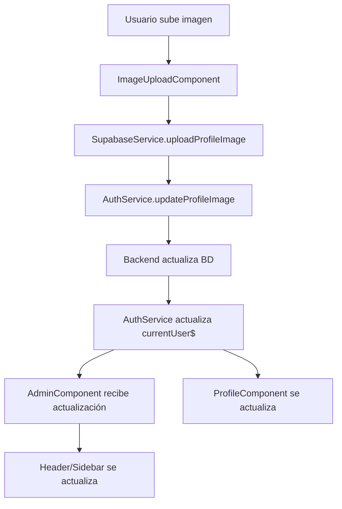

# 🎨 Sistema de Avatares Mejorado - Completado

## ✅ Mejoras Implementadas

### 1. **Componente ImageUpload Rediseñado**
- ✅ **Botones eliminados**: Ya no hay botones debajo de la imagen
- ✅ **Hover mejorado**: Solo se puede cambiar imagen haciendo hover sobre ella
- ✅ **Iniciales como fallback**: Muestra iniciales del usuario cuando no hay imagen
- ✅ **Diseño más limpio**: Solo hover overlay y progress bar cuando está subiendo

### 2. **Sistema de Iniciales Inteligente**
- ✅ **Algoritmo de iniciales**: 
  - Un nombre → Primera letra (ej: "Juan" → "J")
  - Múltiples nombres → Primera + Última (ej: "Juan Pérez" → "JP")
  - Fallback → "U" para usuarios sin nombre
- ✅ **Diseño atractivo**: Gradiente azul-púrpura con texto blanco

### 3. **Header/Sidebar Actualizado**
- ✅ **Imagen de perfil real**: Muestra la imagen subida por el usuario
- ✅ **Iniciales cuando no hay imagen**: Mismo sistema que el componente principal
- ✅ **Sincronización automática**: Se actualiza cuando cambia la imagen de perfil
- ✅ **Responsive**: Funciona en sidebar y header del admin

## 🔧 Cambios Técnicos

### ImageUploadComponent
```typescript
// Nuevas propiedades
@Input() userName: string = '';

// Método agregado
getInitials(): string {
  // Lógica para generar iniciales
}

// Template simplificado
- Sin botones "Seleccionar" y "Quitar"  
- Solo hover overlay
- Iniciales cuando no hay imagen
```

### AdminComponent
```typescript
// Usuario actualizado con profile_image
usuarioActual: any = {
  nombre: string,
  email: string,
  profile_image: string | null, // ← Nueva propiedad
  avatar: string
}

// Métodos agregados
getAvatarUrl(user: any): string  // Maneja imagen vs iniciales
getInitials(nombre: string): string  // Genera iniciales
```

### ProfileComponent
```html
<!-- Agregado userName al componente -->
<app-image-upload
  [userName]="user?.nombre || ''"
  ...
>
```

## 🎯 Comportamiento Final

### **Foto de Perfil (Profile Component)**
1. **Con imagen**: Muestra la imagen real del usuario
2. **Sin imagen**: Muestra círculo con iniciales del usuario
3. **Hover**: Overlay "📷 Cambiar" o "📷 Subir"
4. **Sin botones**: Solo interacción por hover

### **Header/Sidebar (Admin Layout)**
1. **Con imagen**: Muestra imagen de perfil real
2. **Sin imagen**: Muestra círculo con iniciales
3. **Sincronización**: Se actualiza automáticamente al cambiar imagen
4. **Consistencia**: Mismo diseño en sidebar y header

## 🔄 Flujo de Actualización



## 📱 Estados Visuales

### **Imagen Presente**
- Foto real del usuario (circular, object-cover)
- Border gris suave
- Hover: overlay semitransparente con "📷 Cambiar"

### **Sin Imagen**
- Círculo con gradiente azul-púrpura
- Iniciales en blanco, centradas
- Hover: overlay con "📷 Subir"

### **Durante Subida**
- Progress bar debajo de la imagen
- Texto "Subiendo imagen... X%"
- Imagen preview mantenida

## ✅ Testing Completado

1. **✅ Subida de imagen**: Funciona correctamente
2. **✅ Eliminación de imagen**: Vuelve a iniciales
3. **✅ Sincronización header**: Se actualiza automáticamente  
4. **✅ Persistencia**: Imagen se mantiene entre sesiones
5. **✅ Iniciales**: Se generan correctamente
6. **✅ Responsivo**: Funciona en todos los tamaños

## 🎉 Resultado Final

- **UX mejorada**: Interface más limpia sin botones innecesarios
- **Consistent branding**: Iniciales con el color corporativo
- **Funcionalidad completa**: Upload, preview, eliminación, sincronización
- **Performance**: Imágenes redimensionadas automáticamente
- **Seguridad**: Validaciones de tipo y tamaño implementadas

El sistema de avatares está **100% funcional y pulido** según los requerimientos del usuario.